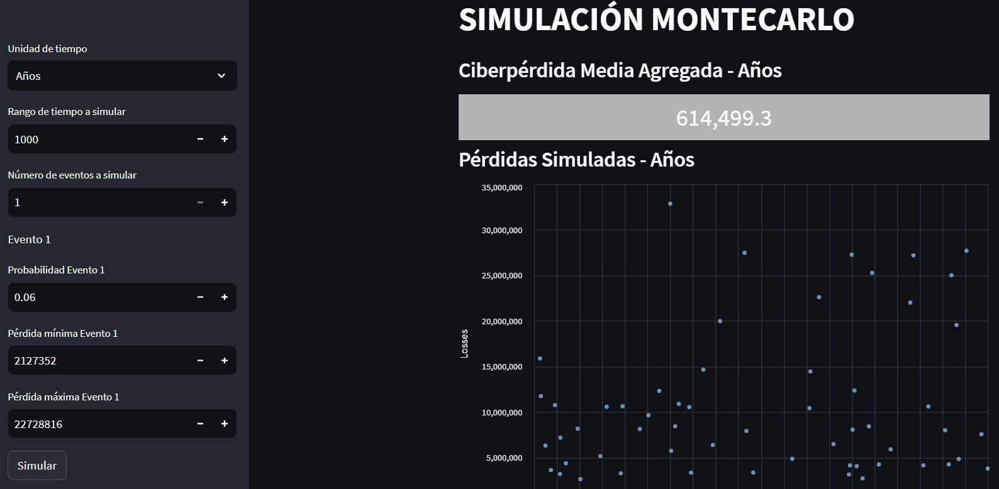

# Simulación Montecarlo - Cyber Loss Simulation

This Streamlit application performs a cyber loss simulation using the Monte Carlo method. It simulates losses based on user-provided event data and displays various visualizations to analyze the results.

## Table of Contents
- [Description](#description)
- [Usage](#usage)

## Description

This Streamlit application allows users to simulate cyber losses based on event data, probability, and loss ranges. It provides visualizations, including scatter plots, loss exceedance curves, and summary tables, to help analyze the simulated cyber losses.

The application is built using Streamlit, a Python library for creating web applications for data science and machine learning.

## Usage

1. Choose the time unit (Years or Months) and set the simulation parameters in the sidebar.
2. Enter the number of time units to simulate, the number of events, event probability, and loss ranges.
3. Click the "Simular" button to run the simulation and view the results.
4. The application will display visualizations and summary tables showing the simulated losses and analysis.

